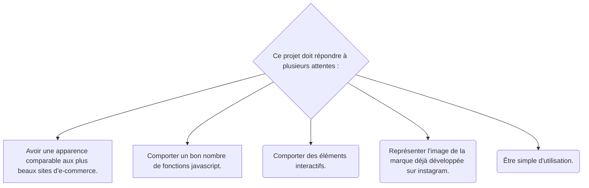

# JewelleryOnline
###### Site et projet de NSI réalisé par DARROU Raphaël, DAVION--JOUFFRE Josselin, GARRISI Jacques et NADIFI Sirine en 1ère 06 ..

### JewelleryOnline est un projet de boutique de vente en ligne de bagues pour la marque Jewellery By Eline. 
Cette marque déjà existante s'est développée sur Instagram (https://www.instagram.com/jewellerybyeline_/ )et ses deux créatrices souhaitent étendre leur activité par l'intermédiaire d'un site de vente en ligne.



### Le site contient 5 pages :
- Acceuil :
C'est la page d'acceuil ou la page principale du site.
- Femme :
C'est la page comportant des bijoux pour les femmes.
- Homme : 
C'est la page comportant des bijoux pour les hommes.
- Soldes :
c'est la page comportant toutes les soldes.
- Nous découvrir :
C'est la page comportant des informations sur la marque avec notemment toute son histoire.

### Le site contient plusieurs effets écrits en Javascript ou CSS :
#### - Un carrousel : 
Un carrousel est un type de module de site Web qui fait la rotation du contenu d'une manière similaire à celle d'un diaporama, soit par une commande de l'utilisateur ou par des transitions temporisées.

Il est utilisé pour prévisualiser l'ambiance du site et certains bijoux choisis. On trouve ci-dessous le début de l'html et ce qui correspond dans le css du carrousel :


```html
<div id="carrousel">
	<div id="container">
	</div>
	
	
</div>
```

```html
}
#container{
	width:800px;
	height:400px;
}
```


#### - Une barre de recherche avec saisie semi-automatique :
Elle permet de rechercher des artcicles afin de simplifier la naviguation au sein du site.
Cette barre de recherche propose les mots ou groupes de mots choisis dans js/suggestions.js comme ci-dessous :

```js
 let suggestions = [
    "Soldes",
 ];
```

#### - L'affichage des tailles sur les bagues :
Cet effet permet d'afficher les différentes tailles proposées (XS/S/M/L). Il se produit lorsque la souris passe sur l'image d'un article. Lorsque cela arrive, l'image se grise et les tailles disponibles de l'article sont indiquées. Cela permet à l'utilisateur de voir directement si la taille qu'il porte est disponible.

#### - Le tableau "à craie" :
Cet effet permet à l'utilisateur de s'amuser à dessiner avec sa souris la bague de ses rêves (ou ce qu'il veut). Unique et ludique, cette fonctionnalité contribue à la relation client que souhaient avoir les deux créatrices. À terme, il serait amélioré pour permettre de stocker les différents dessins et de réaliser des concours dans lesquels chaque utilisateur pourrait donner son avis afin d'élir le plus beau dessin. Ces concours permettraient de créer une réelle proximité avec les clients.

#### - La carte du produit le plus tendance :
Cette carte attractive permet de mettre en avant le produit le plus commandé du mois et donc d'inciter les utilisateurs à commander pour être tendance.


#### - Un POP UP ! :
Cet effet informe l'utilisateur qu'il y a de belles soldes à ne pas manquer. Les soldes sont en réalité essentiellement constituées de produits invendus. Il permet donc encore d'inciter à la consommation mais cible les utilisateurs moins fortunés. Une partie du css du pop est affichée ci-dessous :

```css
.popup{
	position: fixed;
	top: 50%;
	left: 50%;
	transform: trasnlate(-50%, -50%);
	display : none;
}
```
## BIENTÔT EN LIGNE !!

envoie les noms...(jojo)
